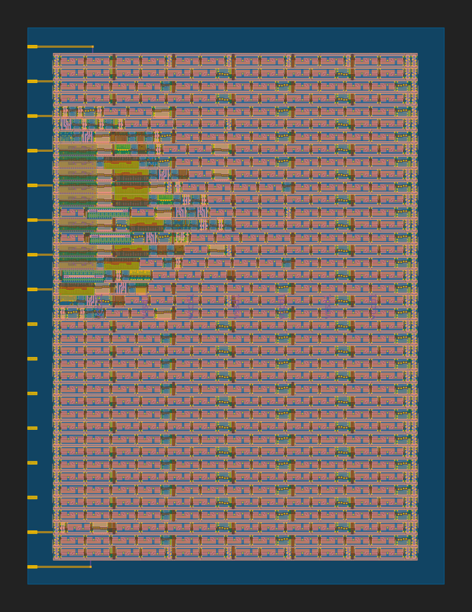

 

# TinyTapeout XLS counter

TinyTapeout design implementing a 8-bit count using [XLS: Accelerated HW Synthesis](https://github.com/google/xls) and [DSLX procs](https://google.github.io/xls/tutorials/intro_to_procs/).

## Resources

* [FAQ](https://tinytapeout.com/faq/)
* [Digital design lessons](https://tinytapeout.com/digital_design/)
* [Join the community](https://discord.gg/rPK2nSjxy8)

## What next?

* Share your GDS on Twitter, tag it [#tinytapeout](https://twitter.com/hashtag/tinytapeout?src=hashtag_click) and [link me](https://twitter.com/matthewvenn)!
